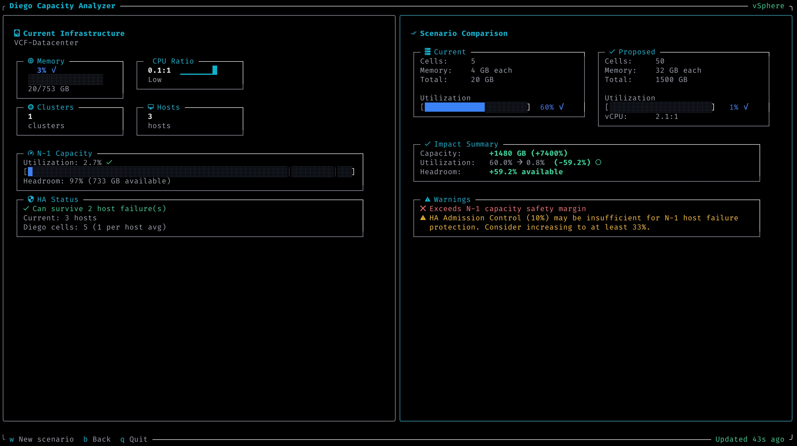

# Diego Capacity CLI

The `diego-capacity` CLI provides both an interactive Terminal User Interface (TUI) and command-line access to the Diego Capacity Analyzer for scripting and CI/CD integration.

## Installation

### From Source

```bash
cd cli
go build -o diego-capacity .

# Install to $GOPATH/bin
go install .
```

### From Makefile

```bash
make cli-build      # Build binary to cli/diego-capacity
make cli-install    # Install to $GOPATH/bin
```

## Configuration

The CLI connects to the Diego Capacity Analyzer backend API.

### Environment Variable

```bash
export DIEGO_CAPACITY_API_URL=http://localhost:8080
```

### Command Line Flag

```bash
diego-capacity --api-url http://backend.example.com:8080 status
```

**Priority order:** `--api-url` flag > `DIEGO_CAPACITY_API_URL` env var > default (`http://localhost:8080`)

## Interactive TUI

When run without arguments in an interactive terminal, `diego-capacity` launches a full-screen Terminal User Interface.

```bash
diego-capacity
```

### Features

| Feature                  | Description                                                         |
| ------------------------ | ------------------------------------------------------------------- |
| **Data Source Menu**     | Choose between live vSphere, JSON file upload, or manual input      |
| **Split-Pane Dashboard** | Infrastructure metrics on left, actions on right                    |
| **Scenario Wizard**      | Step-by-step what-if analysis with cell sizing and HA configuration |
| **Comparison View**      | Side-by-side current vs proposed scenarios with delta highlights    |

### Keyboard Shortcuts

| Key      | Context    | Action                      |
| -------- | ---------- | --------------------------- |
| `w`      | Dashboard  | Run scenario wizard         |
| `r`      | Dashboard  | Refresh infrastructure data |
| `b`      | Comparison | Go back to dashboard        |
| `q`      | Any        | Quit application            |
| `Ctrl+C` | Any        | Quit application            |

### TUI Screenshot

**Scenario Comparison View:**



The TUI displays infrastructure metrics on the left panel (memory utilization, CPU ratio, cluster/host counts, N-1 capacity, and HA status) with scenario comparison results on the right panel showing current vs proposed configurations, impact summary, and warnings.

## Commands

### health

Check backend connectivity and service health.

```bash
diego-capacity health
diego-capacity health --json
```

**Output (human-readable):**

```
Backend:      http://localhost:8080
CF API:       ok
BOSH:         ok
Cells Cached: true
Apps Cached:  false
```

**Output (JSON):**

```json
{
  "backend": "http://localhost:8080",
  "cf_api": "ok",
  "bosh_api": "ok",
  "cache_status": {
    "cells_cached": true,
    "apps_cached": false
  }
}
```

**Exit Codes:**

- `0` - Backend is reachable
- `2` - Connection failed

---

### status

Show current infrastructure status and data source information.

```bash
diego-capacity status
diego-capacity status --json
```

**Output (human-readable):**

```
Infrastructure: production-dc (vsphere)
Clusters:       2
Hosts:          8
Diego Cells:    24

N-1 Capacity:   78% [ok]
Memory:         77% [ok]
Constraining:   memory
```

**Output when no data is loaded:**

```
No infrastructure data loaded.
vSphere is not configured.
Load data via UI or API first.
```

**Output (JSON):**

```json
{
  "has_data": true,
  "source": "vsphere",
  "name": "production-dc",
  "cluster_count": 2,
  "host_count": 8,
  "cell_count": 24,
  "constraining_resource": "memory",
  "vsphere_configured": true,
  "memory_utilization": 77.7,
  "n1_capacity_percent": 78.2,
  "n1_status": "ok",
  "ha_status": "ok"
}
```

**Exit Codes:**

- `0` - Status retrieved successfully
- `2` - Connection failed or no data available

---

### check

Check capacity against thresholds. Useful for CI/CD alerting.

```bash
diego-capacity check
diego-capacity check --memory-threshold 85 --n1-threshold 90
diego-capacity check --json
```

**Flags:**

| Flag                 | Default | Description                              |
| -------------------- | ------- | ---------------------------------------- |
| `--memory-threshold` | 90      | Memory utilization warning threshold (%) |
| `--n1-threshold`     | 85      | N-1 capacity warning threshold (%)       |

**Output (human-readable):**

```
✓ N-1 capacity: 78% (threshold: 85%)
✓ Memory utilization: 77% (threshold: 90%)

PASSED: All 2 check(s) within thresholds
```

**Output when threshold exceeded:**

```
✓ N-1 capacity: 78% (threshold: 85%)
✗ Memory utilization: 92% (threshold: 90%)

FAILED: 1 check(s) exceeded threshold
```

**Output (JSON):**

```json
{
  "status": "passed",
  "checks": [
    {
      "name": "N-1 capacity",
      "value": 78,
      "threshold": 85,
      "unit": "%",
      "passed": true
    },
    {
      "name": "Memory utilization",
      "value": 77,
      "threshold": 90,
      "unit": "%",
      "passed": true
    }
  ]
}
```

**Exit Codes:**

- `0` - All checks passed
- `1` - One or more thresholds exceeded
- `2` - Connection failed or no data available

---

### scenario

Run a what-if scenario comparison without the interactive TUI. Useful for CI/CD pipelines to validate capacity changes before deployment.

```bash
diego-capacity scenario --cell-memory 64 --cell-cpu 8 --cell-count 20
diego-capacity scenario --cell-memory 64 --cell-cpu 8 --cell-count 20 --json
```

**Flags:**

| Flag            | Default | Description              |
| --------------- | ------- | ------------------------ |
| `--cell-memory` | 64      | Memory per cell in GB    |
| `--cell-cpu`    | 8       | CPU cores per cell       |
| `--cell-disk`   | 200     | Disk per cell in GB      |
| `--cell-count`  | 10      | Proposed number of cells |

**Output (human-readable):**

```
Scenario Comparison
==================

Current:
  Cells: 24 x 64 GB
  Utilization: 77.7%

Proposed:
  Cells: 20 x 64 GB
  Utilization: 93.2%

Changes:
  Capacity: -256 GB
  Utilization: +15.5%

Warnings:
  [warning] Utilization exceeds 90% threshold
  [critical] N-1 capacity insufficient for host failure
```

**Output (JSON):**

```json
{
  "current": {
    "cell_count": 24,
    "cell_memory_gb": 64,
    "cell_cpu": 8,
    "cell_disk_gb": 200,
    "app_capacity_gb": 1280,
    "utilization_pct": 77.7,
    "free_chunks": 72,
    "n1_utilization_pct": 82.3,
    "vcpu_ratio": 3.2
  },
  "proposed": {
    "cell_count": 20,
    "cell_memory_gb": 64,
    "cell_cpu": 8,
    "cell_disk_gb": 200,
    "app_capacity_gb": 1024,
    "utilization_pct": 93.2,
    "free_chunks": 17,
    "n1_utilization_pct": 98.5,
    "vcpu_ratio": 3.2
  },
  "delta": {
    "capacity_change_gb": -256,
    "utilization_change_pct": 15.5,
    "resilience_change": "degraded"
  },
  "warnings": [
    { "severity": "warning", "message": "Utilization exceeds 90% threshold" },
    {
      "severity": "critical",
      "message": "N-1 capacity insufficient for host failure"
    }
  ]
}
```

**Exit Codes:**

- `0` - Scenario comparison completed successfully
- `1` - Error (connection failed, no data, backend error)

---

## Global Flags

These flags apply to all commands:

| Flag         | Description                                          |
| ------------ | ---------------------------------------------------- |
| `--api-url`  | Backend API URL (overrides `DIEGO_CAPACITY_API_URL`) |
| `--json`     | Output JSON instead of human-readable text           |
| `-h, --help` | Show help for command                                |

## CI/CD Integration

### GitHub Actions Example

```yaml
name: Capacity Check
on:
  schedule:
    - cron: "0 */6 * * *" # Every 6 hours

jobs:
  check-capacity:
    runs-on: ubuntu-latest
    steps:
      - name: Check TAS Capacity
        env:
          DIEGO_CAPACITY_API_URL: ${{ secrets.CAPACITY_API_URL }}
        run: |
          diego-capacity check --memory-threshold 85 --json > capacity.json

      - name: Alert on Warning
        if: failure()
        run: |
          echo "Capacity threshold exceeded!"
          cat capacity.json
```

### Concourse Pipeline Example

```yaml
resources:
  - name: schedule
    type: time
    source:
      interval: 6h

jobs:
  - name: check-capacity
    plan:
      - get: schedule
        trigger: true
      - task: check
        config:
          platform: linux
          image_resource:
            type: registry-image
            source: { repository: golang, tag: "1.23" }
          params:
            DIEGO_CAPACITY_API_URL: ((capacity-api-url))
          run:
            path: sh
            args:
              - -c
              - |
                diego-capacity check --memory-threshold 85
```

### Shell Script Example

```bash
#!/bin/bash
set -e

# Check capacity and alert if thresholds exceeded
if ! diego-capacity check --memory-threshold 85 --n1-threshold 90; then
    echo "WARNING: Capacity thresholds exceeded!"
    diego-capacity status --json | jq .
    exit 1
fi

echo "Capacity OK"
```

## TTY Detection

The CLI automatically detects whether it's running in an interactive terminal:

| Context                                | Behavior                                     |
| -------------------------------------- | -------------------------------------------- |
| Interactive terminal                   | Launches TUI                                 |
| Piped output (`diego-capacity \| cat`) | Shows help                                   |
| `--json` flag                          | Shows help (use subcommands for JSON output) |
| Non-TTY (CI/CD)                        | Shows help                                   |

To always get non-interactive output, use a specific subcommand:

```bash
# Interactive
diego-capacity

# Non-interactive
diego-capacity status
diego-capacity check
diego-capacity scenario --cell-count 20
```

## Troubleshooting

### "cannot connect to backend"

1. Verify the backend is running: `curl http://localhost:8080/api/v1/health`
2. Check the API URL: `echo $DIEGO_CAPACITY_API_URL`
3. Try with explicit URL: `diego-capacity --api-url http://localhost:8080 health`

### TUI doesn't launch

1. Ensure you're in an interactive terminal (not piped)
2. Don't use `--json` flag with the root command
3. Try: `diego-capacity` without any arguments

### "no infrastructure data available"

1. Check backend has vSphere configured or data loaded
2. Run `diego-capacity status` to see current data source
3. In TUI, select a data source from the menu

## Development

### Running Tests

```bash
cd cli
go test ./...              # All tests
go test ./cmd/... -v       # Command tests with verbose output
go test ./internal/tui/... # TUI component tests
```

### Building

```bash
cd cli
go build -o diego-capacity .
```

### Project Structure

```
cli/
├── main.go                 # Entry point
├── cmd/                    # Cobra commands
│   ├── root.go             # Root command, TTY detection, TUI launch
│   ├── health.go           # Health check command
│   ├── status.go           # Infrastructure status
│   ├── check.go            # Threshold checking
│   └── scenario.go         # Scenario comparison
└── internal/
    ├── client/             # HTTP client for backend API
    │   └── client.go
    └── tui/                # Terminal UI components
        ├── app.go          # Root TUI model
        ├── styles/         # Lipgloss styles
        ├── menu/           # Data source menu
        ├── dashboard/      # Infrastructure dashboard
        ├── wizard/         # Scenario wizard
        └── comparison/     # Comparison view
```
